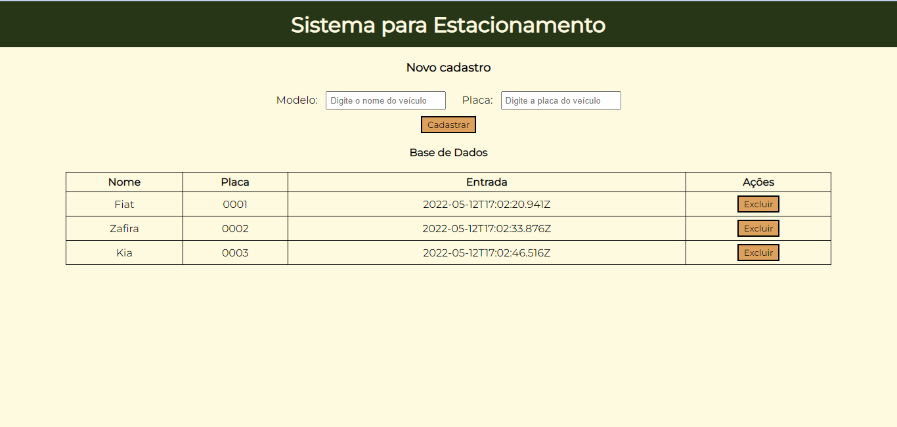

# Sistema para Estacionamento 

Projeto desenvolvido durante o curso de Introdução a TypeScript do Bootcamp Spread Fullstack Developer proporcionado pela Digital Innovation One em parceria com a Spread Tecnologia. 

O sistema desenvolvido possui as seguintes funcionalidades:
 - o usuário é capaz de cadastrar um carro, inserindo o modelo e a placa;
 - o carro adicionado é mostrado na tabela com seus dados e a hora em que foi cadastrado;
 - o usuário pode excluir um determinado carro do banco de dados;
    - o sistema retorna o tempo que o carro permaneceu no pátio;
    - o sistema confirma se o usuário deseja realmente excluir o carro. 

